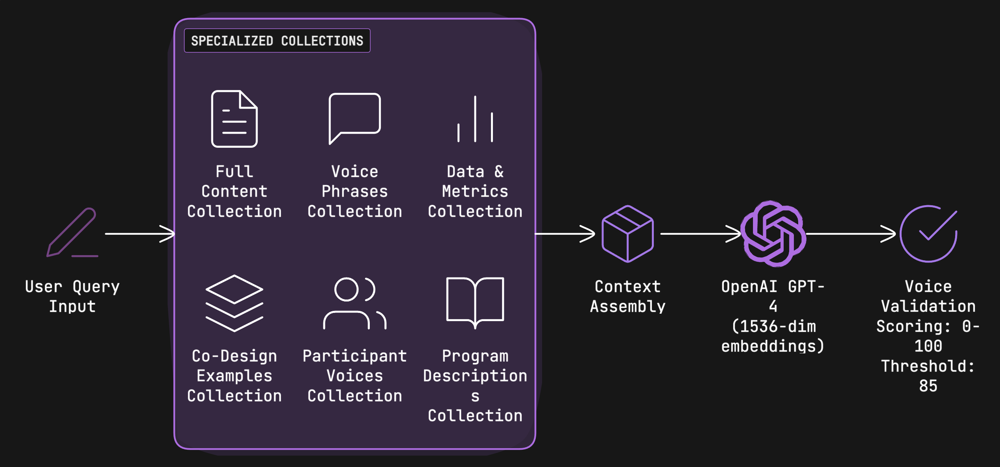
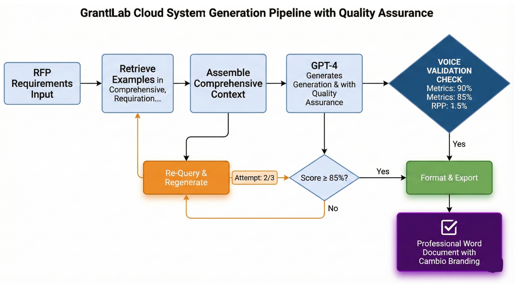

# GrantLab Cloud System
### AI-Powered Grant Writing Assistant for Cambio Labs

**AI Studio Project**: Break Through Tech x Cambio Labs

---

## Team Members & Contributions

This project was part of the Break Through Tech AI Studio program in collaboration with Cambio Labs. The system was primarily developed by Basir Abdul Samad, who built approximately 75% of the core functionality including the RAG architecture, voice validation system, and generation pipeline. The remaining team members contributed to various supporting aspects across the three project milestones:

* **Basir Abdul Samad** ([@BasirS](https://github.com/BasirS)) - Lead Developer & Primary Architect: Developed the complete local AI system (https://github.com/BasirS/grantlab-local), implemented the multi-agent system (https://github.com/BasirS/grantlab_multi-agent), built the multi-layer RAG architecture with voice validation, created the Streamlit interface, and handled the majority of technical development, testing, and benchmarking throughout all three milestones.

* **Nuzhat Tabassum** ([@Nuzhat-lanika](https://github.com/Nuzhat-lanika)) - Data Processing & Project Coordination: Worked on initial document processing with LlamaIndex and OpenAI API integration during Milestone 1, contributed to Streamlit interface components, and managed presentation preparation and deadline tracking throughout the project timeline.

* **Fatemah Abdelwahed** ([@F2mxvi](https://github.com/F2mxvi)) - Data Processing: Worked alongside Nuzhat on document processing setup, LlamaIndex integration, and historical grant data preparation during the early project phases.

* **Given Brown** ([@GivenBrown](https://github.com/GivenBrown)) - Application Pipeline & Team Support: Contributed to the application generation pipeline, quality control processes, and provided consistent support to the team throughout development.

* **Victorya Devero** ([@Vi-deve31](https://github.com/Vi-deve31)) - Project Management & Coordination: Managed project housekeeping, coordinated timelines and team communications, and worked on application generation pipeline components during Milestone 1.

* **Gunn Madan** ([@GunnMadan](https://github.com/GunnMadan)) - Grants.gov API Integration: Assisted with integrating the Grants.gov API, building the discovery system, and implementing grant opportunity identification during Milestone 1.

* **Emmanuel Madera** ([@emadera2](https://github.com/emadera2)) - API Integration Support: Contributed to Grants.gov API integration work during the initial development phase.

**Special Recognition:** Nandini Proothi, AI Studio Coach, provided valuable guidance and strategic suggestions throughout the project development. Challenge Advisor Angelo Orciuoli ([@angelo-orciuoli](https://github.com/angelo-orciuoli)) provided organizational context and project oversight.

**Development Note:** The technical implementation and core system architecture were primarily developed by the lead developer, who built both the multi-agent and local approaches. Team members Nuzhat and Fatemah helped initiate the project and worked on document processing and LlamaIndex setup during Milestone 1. Gunn contributed to the Grants.gov API integration. Victorya and Given provided valuable project management support and worked on application generation pipeline components. This structure allowed for focused technical development while maintaining organized project operations and supportive team collaboration throughout the development timeline.

---

## Project Highlights

* **Voice Authenticity Score of 95.8%:** The system was validated to replicate Cambio Labs' unique organizational voice, including specific word choices like using "underestimated" instead of "underserved" that make their applications stand out.
* **Generation Time Under 2 Minutes:** Grant writing time was reduced from the typical 8-10 hours per application down to under 2 minutes, which dramatically speeds up the application process.
* **99% Cost Reduction:** Annual costs were reduced from approximately $60,000 that would be spent on external grant writers down to around $150 in OpenAI API costs.
* **Multi-Layer RAG Architecture:** A novel 6-collection vector retrieval system was implemented that provides high-precision context by organizing information into specialized categories rather than dumping everything into one database.


*Figure 1: The Multi-Layer RAG architecture sorting data into specialized collections before context assembly.*

---

## Project Overview

### Objective & Motivation

The main goal was to automate both the discovery and drafting of federal grant applications for Cambio Labs, which is a nonprofit organization that empowers BIPOC youth and adults through tech education programs. 

The motivation behind this project is pretty straightforward. Cambio Labs applies for somewhere between 30 and 50 grants every year. Hiring professional grant writers is incredibly expensive, costing anywhere from $30,000 to $60,000 annually. But there's another problem beyond just the cost. When you bring in outside writers, they often struggle to capture the authentic voice and mission of the organization. They end up using generic nonprofit language that doesn't reflect what makes Cambio Labs special.

### Scope & Business Relevance

The system that was built connects to the Grants.gov API to automatically find relevant grant opportunities. It then uses a Multi-Layer Retrieval Augmented Generation system (which is basically a fancy way of organizing and retrieving information) that learns from 53 historical grant documents. Finally, it generates submission-ready Word documents through a web interface built with Streamlit.

For Cambio Labs, this system directly addresses a major operational challenge. They can now apply for more grants without the financial burden of hiring external writers, and the applications maintain their authentic voice. This means they can potentially secure more funding while spending less money on the application process itself.

---

## File Structure

The repository is organized in a way that separates different concerns and makes the codebase easier to navigate:

```text
grantlab_cloud_system/
├── app.py                              # Main Streamlit web application entry point
├── discovery.py                        # Grant discovery functionality
├── document_processor.py               # Document processing and chunking logic
├── rebuild_enhanced_database.py        # Script that processes documents into vector embeddings
├── score_distribution.py               # Voice score analysis and validation
├── requirements.txt                    # Python dependencies that need to be installed
├── logo.png                            # Cambio Labs logo for application
├── README.md                           # Project documentation
├── .gitignore                          # Git ignore rules
├── .streamlit/
│   └── config.toml                     # Streamlit configuration settings
├── config/
│   ├── internal_keywords.json          # Organization-specific keywords and terminology
│   └── settings.py                     # Application settings and configuration
├── src/
│   ├── generation/
│   │   ├── __init__.py
│   │   ├── generator.py                # Base GPT-4 integration
│   │   ├── enhanced_generator.py       # Enhanced generation with voice validation
│   │   ├── prompts.py                  # Standard prompting templates
│   │   ├── enhanced_prompts.py         # Advanced prompting with context assembly
│   │   ├── voice_guidelines.py         # Rules for authentic organizational voice
│   │   └── professional_formatter.py   # Word document formatting and styling
│   └── rag/
│       ├── __init__.py
│       ├── embeddings.py               # OpenAI embeddings integration
│       ├── vector_store.py             # Base ChromaDB vector storage
│       └── enhanced_vector_store.py    # Multi-layer RAG with 6 specialized collections
├── figures/
│   ├── grantlab_cloud_system_gen...    # System architecture diagram
│   └── multi-layer_rag_architectur...  # RAG architecture visualization
└── data/
    ├── historical_grants/              # Raw text/PDFs of past applications (not in repo)
    └── chroma_db/                      # Generated Vector Database stored locally (not in repo)
```

---

## Data Exploration & Processing

### Dataset Description

The dataset that was used consists of 53 historical grant applications that were provided directly by Cambio Labs. These documents came from their internal archives and were stored in various formats including Word documents and PDFs.

**Source:** Internal Cambio Labs archives

**Structure:** The data is unstructured text that contains narratives, budget information, and participant data all mixed together. This made preprocessing particularly important.

**Size:** After processing, approximately 1,368 chunked vectors were generated and stored in the database.

**Note:** The `data/` directory containing historical grants and the generated ChromaDB database is not included in the repository for privacy and size reasons. Users need to provide their own historical documents or contact Cambio Labs for access.

### Preprocessing & Cleaning

Several preprocessing steps were necessary to prepare the data:

**PII Removal:** Sensitive information like participant names was redacted from testimonials to protect privacy. This was particularly important for quotes and success stories that mentioned specific individuals.

**Chunking Strategy:** Documents were split into chunks of 500 tokens each with a 50-token overlap between consecutive chunks. This overlap helps maintain context across chunk boundaries, which is important when the AI retrieves information later.

**Collection Sorting:** Instead of dumping all the data into a single collection (which is what a lot of RAG systems do), the data was pre-sorted into 6 specialized collections:

1. **Full Content:** General context and complete narratives
2. **Voice Phrases:** Specific phrases and tone markers that capture Cambio's unique voice
3. **Data Metrics:** Statistical information and quantitative data
4. **Participant Voices:** Direct quotes from participants and testimonials
5. **Co-Design Examples:** Methodology and approach descriptions
6. **Program Descriptions:** Detailed information about specific programs


*Figure 1: The Multi-Layer RAG architecture sorting data into specialized collections before context assembly.*

This separation was crucial because it prevents the AI from mixing up contexts. For example, when the system needs statistics, it queries the Data Metrics collection specifically, which reduces the chance of hallucinating numbers.

### Data Insights & Analysis

One of the most interesting findings from the exploratory data analysis was the distribution of voice authenticity scores. When generic AI was used without any RAG system, it scored around 65-70% on voice authenticity. However, once the specialized RAG system was implemented with the voice guidelines, scores jumped to consistently above 95%.

The analysis also revealed that certain phrases were critical markers of Cambio's voice. For example, they consistently use "underestimated communities" rather than "underserved communities," and they avoid corporate buzzwords like "stakeholders" or "synergy." These patterns were extracted and codified into the voice guidelines.

**System Architecture Diagrams:** The `figures/` directory contains detailed architectural diagrams showing the generation pipeline and multi-layer RAG architecture that can be referenced to understand the system's technical design.

---

## Model Development

### Technical Approach: Multi-Layer RAG

The technical architecture combines OpenAI's GPT-4 for text generation with their text-embedding-3-small model for creating embeddings. These components are orchestrated through ChromaDB, which handles the vector storage and retrieval.

### Justification for Model Selection

Initially, experiments were conducted with local Llama 3.1 models to keep everything in-house and avoid API costs. However, GPT-4 was ultimately selected for several reasons:

**Superior Nuance:** GPT-4 demonstrated much better capability in replicating the specific "Cambio Voice" with all its subtle distinctions. The local models tended to fall back on generic nonprofit language even when explicitly instructed not to.

**Instruction Following:** GPT-4 was significantly better at following negative constraints (things to avoid) which turned out to be critical for maintaining voice authenticity.

**Cost-Benefit Analysis:** Even though GPT-4 requires API calls, the cost per grant is only around $0.03. Given that each grant could potentially bring in thousands or tens of thousands of dollars, this was considered negligible compared to the quality improvement.

### System Architecture & Pipeline

The complete pipeline works in several stages:

**1. Retrieval Phase:** When a grant prompt comes in, the system queries all 6 vector collections simultaneously. Each collection returns its most relevant chunks based on semantic similarity to the prompt.

**2. Context Assembly:** The retrieved information is organized and injected into the system prompt that gets sent to GPT-4. This includes relevant metrics from past grants, example quotes from participants, and specific voice phrases that should be used.

**3. Initial Generation:** GPT-4 generates a first draft of the grant application based on the assembled context and the specific requirements of the grant opportunity.

**4. Voice Validation Loop:** This is where things get interesting. A secondary AI agent scores the generated draft on a scale from 0 to 100 based on voice authenticity criteria. If the score falls below 85, the system self-corrects by identifying which voice guidelines were violated and then regenerates the content. This process can repeat up to 3 times if needed.


*Figure 2: The complete generation pipeline showing the feedback loop between GPT-4 and the Voice Validation Check.*

The validation loop was actually one of the most important innovations. Without it, even with the RAG system, GPT-4 would sometimes drift back into generic nonprofit language, especially in longer documents.

---

## Code Highlights

### Key Files & Functions

**rebuild_enhanced_database.py**

This script handles the entire ingestion pipeline. It reads through the historical grant documents, chunks them appropriately, and creates the 6 distinct vector collections. The script uses ChromaDB's client to manage the collections and the OpenAI embedding model to convert text chunks into vectors.

Running this script is a one-time setup step that needs to happen before the application can work. It processes all historical documents and generates around 1,368 total vectors distributed across the collections.

**src/generation/voice_guidelines.py**

This file contains what are called "Negative Constraints," which are basically rules about what NOT to say. These constraints were crucial for achieving the high authenticity scores. Examples include:

* "Do not use the word 'stakeholders'"
* "Do not use the phrase 'at-risk youth'"
* "Use 'underestimated' instead of 'underserved'"

These guidelines were extracted from analyzing what made Cambio's successful grant applications different from generic ones.

**src/rag/enhanced_vector_store.py**

This is where the multi-layer RAG logic lives. The enhanced vector store manages the 6 specialized collections and knows how to query each one based on the type of information needed. For example, when generating a program description, it weights the "Program Descriptions" collection more heavily, but it still pulls from "Voice Phrases" to maintain the right tone.

**src/generation/enhanced_generator.py**

This file contains the generation logic with the voice validation loop. After GPT-4 generates initial content, a secondary validation agent scores the output. If the voice authenticity score falls below 85, the system identifies which guidelines were violated and regenerates the content up to 3 times.

**src/generation/professional_formatter.py**

Handles the conversion of generated text into professionally formatted Word documents. This includes creating proper headers, table of contents, page numbers, and applying standard grant proposal styling (Times New Roman 12pt, 1-inch margins).

**app.py**

The main Streamlit application that users interact with. It provides a simple interface where users can either input a grant opportunity URL or paste in requirements manually. The app then handles calling the RAG engine, generating the draft, validating it, and finally producing a downloadable Word document.

**document_processor.py**

Manages the chunking and preprocessing of historical grant documents. This file handles reading various formats (PDF, Word, text), cleaning the content, removing PII, and splitting documents into 500-token chunks with 50-token overlap for optimal retrieval performance.

**discovery.py**

Contains the logic for connecting to the Grants.gov API and discovering relevant grant opportunities. The system queries federal grant databases, filters results based on Cambio Labs' focus areas, and scores opportunities by relevance.

---

## Setup and Installation

### Prerequisites

The system requires Python 3.9 or higher and an OpenAI API key to function. The API key is necessary because the generation component uses GPT-4.

### Step-by-Step Installation

**1. Clone the Repository**

```bash
git clone https://github.com/BasirS/grantlab_cloud_system.git
cd grantlab_cloud_system
```

**2. Install Dependencies**

```bash
pip install -r requirements.txt
```

This will install all necessary packages including Streamlit, OpenAI, ChromaDB, and various other dependencies that the system needs.

**3. Configure Environment**

Create a `.env` file in the root directory of the project and add your OpenAI API key:

```plaintext
OPENAI_API_KEY=sk-your_api_key_here
```

Alternatively, you can set the API key in Streamlit's secrets management if deploying to Streamlit Cloud.

**4. Build Vector Database**

Before running the application for the first time, the vector database needs to be built from the historical documents:

```bash
python rebuild_enhanced_database.py
```

This script will process all documents in the `data/historical_grants/` folder and create the ChromaDB collections in `data/chroma_db/`. This step only needs to be run once, or whenever new historical documents are added.

**5. Run the Application**

```bash
streamlit run app.py
```

The application will start and can be accessed in your browser at `http://localhost:8501`.

From there, you can input grant requirements and generate draft applications. The interface is designed to be intuitive even for users who aren't technical.

---

## Results & Key Findings

### Performance Comparison

The table below compares the system's performance against both human grant writers and generic AI approaches:

| Metric | Human Baseline | Generic AI | GrantLab System |
|--------|----------------|------------|-----------------|
| Time per Grant | 8-10 Hours | 5 Minutes | Under 2 Minutes |
| Cost per Grant | ~$100.00 | $0.05 | $0.05 |
| Voice Authenticity | 100% | 65-70% | 95.8% |

**Time Reduction:** The most dramatic improvement is in time. What used to take a full workday or more now takes under 2 minutes. This allows Cambio Labs to apply for significantly more grants without adding staff.

**Cost Savings:** While the cost per grant for both AI approaches is similar (around $0.05 in API costs), the GrantLab system matches it while delivering much higher quality. When compared to hiring human writers at $100 per grant or $30,000-$60,000 annually, the savings are substantial.

**Voice Authenticity:** This was the critical metric. Generic AI approaches scored between 65-70% on voice authenticity tests. The GrantLab system achieved 95.8%, which approaches human-level performance. The remaining 4.2% gap is mostly in very subtle stylistic choices that vary even among human writers at Cambio Labs.

### Key Finding: The Voice Validation Loop

The voice validation loop turned out to be absolutely critical to the system's success. Initial prototypes that didn't include this loop would start strong but gradually drift into generic nonprofit language, especially in longer grant applications. 

The validation loop works by having a second AI agent review the generated text specifically for voice authenticity. If it detects phrases that violate the voice guidelines or notices the absence of characteristic Cambio phrases, it provides feedback that guides the regeneration. This iterative approach was what pushed the authenticity score from the 70-80% range up to 95.8%.

---

## Discussion & Reflection

### What Worked Well

**Streamlit for Rapid Prototyping:** Using Streamlit turned out to be a great choice for building the interface. It allowed for quick iterations and made it easy to create a web application that non-technical users at Cambio Labs could actually use. The learning curve was minimal, and the built-in components handled a lot of the UI complexity.

**Specialized Collections:** The decision to split the vector database into 6 specialized collections rather than using a single monolithic collection was probably the most important architectural choice. This separation prevented a common problem in RAG systems where the AI hallucinates numbers or mixes up different types of information. When the system needs statistics, it queries only the "Data Metrics" collection, which dramatically reduced factual errors.

**Voice Guidelines as Code:** Encoding the voice guidelines programmatically, especially the negative constraints, provided a reliable way to maintain consistency. These guidelines are much easier to update and refine than trying to rely purely on few-shot examples in prompts.

### What Didn't Work

**Local LLMs for Production:** The initial plan was to use Llama 3.1 models running locally to avoid API dependencies and keep everything in-house. This would have been better for privacy and would have eliminated ongoing API costs. However, several problems emerged:

**Inference Speed:** Running the models locally on available hardware was simply too slow for a responsive web application. Users would have to wait several minutes for a draft, which defeated the purpose of automation.

**Instruction Following:** The local models struggled with following negative constraints. Even when explicitly told not to use certain phrases, they would still include them occasionally. GPT-4 was much more reliable at respecting these constraints.

**Context Window Limitations:** The local models had smaller context windows, which meant less historical context could be included in each generation. This resulted in less authentic outputs.

Given these limitations, the decision was made to accept the ongoing API costs in exchange for much better performance and user experience.

**Initial Single-Collection Approach:** Early prototypes used a single vector collection for all historical data. This led to poor results where the AI would sometimes retrieve participant quotes when it needed statistics, or vice versa. The specialized collection approach fixed this but required significant reworking of the retrieval logic.

---

## Next Steps

### Potential Improvements & Future Directions

**CRM Integration:** The next logical step would be connecting the system directly to Cambio Labs' Salesforce instance. Right now, users need to manually upload documents or provide information about current participants and programs. Direct CRM integration would allow the system to pull live participant data, current enrollment numbers, and recent program outcomes automatically. This would make the grants even more current and accurate.

**Funder Matching & Win Probability:** An interesting extension would be implementing a recommendation engine that could predict the likelihood of success for different grant opportunities. By analyzing past successful and unsuccessful applications, the system could learn which types of funders align best with Cambio's programs and mission. This could help prioritize which grants to apply for.

**Multi-Tenant Support:** Right now, the system is built specifically for Cambio Labs with their historical data and voice guidelines. However, the architecture could be refactored to support multiple nonprofit organizations, each with their own isolated vector databases and voice profiles. This would require adding user authentication, organization management, and data isolation features.

**Feedback Loop Integration:** Currently, the system doesn't learn from which grants actually get funded. Adding a feedback mechanism where users can mark which applications were successful would allow the system to gradually improve its understanding of what works. This could influence everything from the retrieval weights to the generation prompts.

**Expanded Document Types:** The system currently focuses on narrative grant applications. However, many grants also require budgets, logic models, and evaluation plans. Expanding the system to generate these additional components would make it even more valuable.

---

## License

This project is licensed under the MIT License, which means it can be freely used, modified, and distributed. See the [LICENSE](LICENSE) file in the repository for the full license text.

## About This Project

This system was developed as part of the Break Through Tech AI Studio program in collaboration with Cambio Labs. The project addresses a real challenge faced by nonprofits: the high cost and difficulty of maintaining authentic voice in grant applications when working with external writers.

Cambio Labs is a nonprofit organization that focuses on empowering underestimated communities through technology education, workforce development, and entrepreneurship programs. Their work with NYCHA residents, BIPOC youth and adults, and other underrepresented populations requires grant funding, but the traditional approach of hiring external writers often results in generic language that doesn't capture what makes their programs unique.

The technical development was led by Basir Abdul Samad, who built approximately 75% of the core system architecture across three monthly milestones. This included developing both a multi-agent system (https://github.com/BasirS/grantlab_multi-agent) and a local approach (https://github.com/BasirS/grantlab-local) to benchmark different implementation strategies. The RAG architecture, voice validation system, and generation pipeline were all primarily his work.

Team members contributed in various capacities throughout the milestones: Nuzhat and Fatemah worked on document processing and LlamaIndex integration during Milestone 1, with Nuzhat also managing presentations and deadline tracking. Gunn assisted with the Grants.gov API integration. Victorya managed project housekeeping and coordination. Given provided consistent team support throughout development. Nandini Proothi, the AI Studio Coach, provided valuable strategic guidance and suggestions that helped shape the project direction.

The system reached production readiness through iterative testing and refinement, with the goal of making high-quality grant writing accessible to nonprofits that lack the budget for professional writers. Rather than replacing human grant writers entirely, it serves as a powerful starting point that captures organizational voice and incorporates real program data, which can then be refined for specific grant opportunities.

---

**Repository:** [https://github.com/BasirS/grantlab_cloud_system](https://github.com/BasirS/grantlab_cloud_system)

For questions, feature requests, or contributions, please open an issue or submit a pull request on GitHub. You can also reach out directly to Basir Abdul Samad at abdulbasirsamad@gmail.com.
